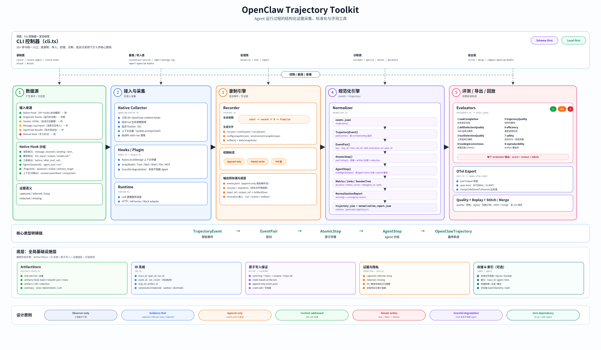

# Trajectory Toolkit: OpenClaw Trajectory Capture Tool

[中文](README.md) | [English](README.en.md)

## 1. Introduction

**OpenClaw Trajectory Toolkit** turns the execution process of AI agents such as OpenClaw into standardized, evaluable, structured evidence.

In addition to recording the final end-to-end answer, it captures as much of the agent process as possible: which model was called, which tools were used, which files were read, how many failures occurred, how many tokens were consumed, how long the task took, which information was redacted, and whether the resulting record is suitable for evaluation. It consolidates scattered logs into a standard `trajectory.json`; records model, tool, shell, skill, state, and sub-agent steps; preserves artifact evidence with redaction support; outputs normalization coverage and quality readiness; provides immediate quality feedback through eight built-in evaluators; supports normalization from native hooks, session JSONL, message logs, and OpenClaw bundles; and provides a foundation for later review, debugging, regression testing, and evaluation-data production.



**Recommended next steps:**

If you are a **first-time user**, run `quicktest` once and inspect the generated `trajectory.json`. Pay special attention to the structure of `root_step` and `agent_steps`.

If you are an **agent developer**, run `reconstruct-session` on one of your own tasks and check whether the agent process evidence is complete. If the `quality` report shows `limited`, inspect the listed `reasons` one by one.

If you are building an **evaluation system**, focus on `quality` and `evaluators`. They connect trajectory collection with evaluation decisions. In particular, build a set of regression fixtures from real OpenClaw tasks so that `trajectory.json` is stable on complex real workloads, not only on examples.

If you are a **security engineer**, focus on the `safety` evaluator and the redaction mechanism. The former can block dangerous operations in CI; the latter helps prevent trajectory data from leaking secrets.

Although the toolkit is designed for the OpenClaw ecosystem, its core ideas, namely schema-first, evidence-aware, and evaluation-oriented data collection, are also useful for other agent platforms.

---

## 2. Background: Why Trajectory Data Matters

### 2.1 What Is a Trajectory?

- **A trace is a full execution record produced while a request or task flows through a system.**
It describes the path from start to finish, including the components involved, operations performed, parent-child relationships, chronological order, inputs, outputs, status, latency, and exceptions.
In an agent setting, a trace can be understood as the raw execution stream recorded by the system while an agent completes a task.

- **A trajectory is a structured sequence of key steps produced during an agent task.**
It records the important observations, decisions, actions, and results between receiving the user request and returning the final answer. It reflects the core behavioral path used by the agent to complete the task.
For evaluation, a trajectory can be defined as a sequence of key agent execution steps extracted, cleaned, compressed, and semanticized from traces, model logs, or business logs.
It is structured time-series data generated during an AI agent task, usually represented as JSON, and it records the full multi-turn history from the initial user instruction through the agent's reasoning, actions, and observations.

### 2.2 Agent Execution Is Often a Black Box

Imagine that an agent returns an obviously wrong answer in production. You open the logs to understand why, but you only see the prompt and the final response. The intermediate tool calls, tool results, and model context that drove the decision are missing.

Ordinary chat records usually show only the user message, the final assistant answer, and occasionally a fragment of tool output.

The process evidence that determines answer quality is often incomplete:

- What context did the model actually receive?
- What were the tool-call arguments?
- Were tool results truncated?
- Did a sub-agent participate?
- Did the agent retry after an error?
- What were the token usage, latency, and cost?
- Was the final answer grounded in real tool results, or did the model guess?

Without this process evidence, reliable review and evaluation become very difficult.

### 2.3 Logs Are Scattered and Inconsistent

A single OpenClaw task may involve session JSONL, model-call hooks, tool-call hooks, diagnostic events, message send/receive events, sub-agent lifecycle events, manual notes, external message logger records, and officially exported OpenClaw bundles.

These sources do not share identical field names, timestamps, IDs, or parent-child relationships. Without normalization, downstream evaluation systems cannot consume them reliably.

### 2.4 Agent Evaluation Should Inspect Results and Process

To judge whether an agent is reliable, final task success is only one part of the picture. Evaluation also needs to inspect whether the agent used the right tools, handled errors correctly, leaked sensitive information, produced enough model/tool pairing evidence, captured token usage and latency, supports replay or mock replay, and distinguishes captured evidence from manual notes.

For that reason, a trajectory is a **structured record format for evaluation and review**. Its value goes far beyond ordinary logging.

### 2.5 Why Existing Solutions Are Not Enough

There are many existing open-source projects and observability platforms. The table below compares OpenTelemetry and LangSmith / LangFuse with Trajectory Toolkit.

| Dimension | [OpenTelemetry](https://github.com/open-telemetry/opentelemetry-collector) | [LangSmith](https://github.com/langchain-ai/langsmith-cookbook) / [LangFuse](https://github.com/langfuse/langfuse) | Trajectory Toolkit |
| --- | --- | --- | --- |
| Deployment model | Requires collector + backend service | SaaS / self-hosted | **Local-first**, no external service required |
| Data ownership | Data is sent remotely | Data lives in a third-party platform | **All data stays local** |
| Agent semantics | Generic spans, no native agent semantics | Has chain/tool concepts | **Native Agent/Tool/Skill/SubAgent semantics** |
| Evidence fidelity labels | None | None | **Distinguishes captured/inferred/lossy/redacted** |
| Evaluation readiness | None | Evaluation exists but is coupled with collection | **Independent quality assessment + 8 built-in evaluators** |
| Privacy protection | Requires extra configuration | Depends on the platform | **Built-in redaction and automatic sanitization** |
| Runtime dependencies | SDK + collector | SDK + network | **Only ajv + safe-regex2** |

In short, Trajectory Toolkit is positioned around **local-first + evidence-aware + evaluation-oriented** workflows. It focuses on the specific use case of serious evaluation based on agent process data, and it can complement OTel or LangSmith as dedicated evaluation infrastructure.

---

## 3. What Problem Does This Tool Solve?

This toolkit provides data infrastructure for agent evaluation and review:

1. **Standard schemas**: make data stable for evaluation systems.
2. **Multi-source normalization**: native hooks, diagnostic events, session JSONL, message logs, and bundles can all be mapped into one format.
3. **Evidence quality awareness**: clearly distinguishes `captured`, `inferred`, `lossy`, `redacted`, and `missing`.
4. **Safe, traceable IDs**: normalizes invalid IDs with sanitize + short hash while preserving the raw ID.
5. **Privacy protection**: uses artifact references and redaction to preserve evidence while reducing leakage risk, covering 7+ common secret categories.
6. **Automated assessment**: eight built-in evaluators provide immediate quality feedback, and the safety evaluator can block dangerous trajectories in CI.
7. **Engineering verifiability**: `npm test`, `quicktest`, `validate`, and `quality` form a basic validation loop.
8. **OpenClaw architecture alignment**: converts runtime telemetry into evaluation-friendly structured trajectories.

### 3.1 Consolidate Messy Execution Logs into a Standard Trajectory

The toolkit converts events from different sources into one unified structure: what the task was, which agents participated, what each agent did, which steps were model calls, which were tool calls, which failed, where the input/output evidence is stored, and whether the overall data quality is suitable for evaluation.

The core output is `trajectory.json`.

### 3.2 Keep IDs Schema-Valid While Preserving Raw Traceability

IDs in real runtime logs do not always comply with the schema. For example, some `tool_call_id` values may contain special characters that fail JSON Schema validation.

The toolkit does two things: it converts invalid IDs into schema-safe IDs, and it preserves the raw ID in metadata such as `openclaw.raw_tool_call_id`.

The normalization process looks like this:

```text
Raw ID:             call_abc!@#$%^&*123
                         ↓ sanitize (replace unsafe characters with _)
Intermediate:       call_abc_________123
                         ↓ truncate to 32 chars + append SHA-256 short hash
Canonical ID:       call_abc_________123_a7f3b2c1d4e5
                         ↓ preserve raw value in metadata
metadata:           "openclaw.raw_tool_call_id": "call_abc!@#$%^&*123"
```

This keeps the data readable by evaluation systems while retaining the original clues needed for debugging.

### 3.3 Map Runtime Telemetry into Readable Steps

The toolkit maps OpenClaw runtime events into action-level steps that are easier to understand:

- `model.call.*` -> model-call steps;
- `tool.execution.*` -> tool-execution steps;
- `context.assembled` -> context assembly information;
- `run.*` -> task lifecycle;
- `session.long_running/stalled/stuck` -> session health state;
- `subagent_*` -> sub-agent relationships.

This upgrades a trajectory from a simple chat record into process evidence that is closer to the real execution chain.

### 3.4 Evaluate Data Quality Before Trusting the Logs

The toolkit outputs `quality` and `normalization_report.json`, showing whether the data is complete, which fields were captured, which were inferred, which are missing, which were redacted, and whether the trajectory is suitable for formal evaluation.

This is important: **an incomplete trajectory can still be useful, but it must not be treated as high-fidelity evidence.**

---

## 4. Core Concepts

### 4.1 Run: One Task Execution

A `run` is one complete task, for example:

> "Analyze a toolkit and write an introduction document."

Each run has its own directory:

```text
~/.openclaw/trajectory/runs/<run_id>/
```

That directory stores all evidence for the task.

### 4.2 Event: Raw Event

Each line in `events.jsonl` is one event, such as model call started, model call completed, tool execution started, tool execution completed, shell command executed, file operation, state snapshot, sub-agent started, or sub-agent finished. Events are the raw ledger.

### 4.3 Artifact: Large Input/Output Evidence

Model inputs, tool inputs, and tool outputs may be large or may contain sensitive content. The toolkit stores them as artifacts and references them from the trajectory:

```text
artifact://tool_call_inputs_xxx/yyy.json
artifact://model_call_outputs_xxx/yyy.json
```

Artifacts are content-addressed: each artifact filename is derived from the SHA-256 hash of its content. If the same system prompt is passed to the model many times, which is common in real systems, it is stored only once and saves disk space.

This design provides several benefits:

- `trajectory.json` does not grow without bound;
- sensitive fields can be redacted;
- large files remain traceable;
- evaluation systems can load evidence on demand;
- repeated content is deduplicated automatically.

### 4.4 Trajectory: The Structured Task Path

`trajectory.json` is the core artifact. It turns raw events into a structure that humans and machines can understand:

- `root_step`: the whole task;
- `agent_steps`: work segments for each agent;
- `steps`: model, tool, shell, skill, state, and other concrete actions;
- `metrics_info`: latency, tokens, error rate, cost, and related metrics;
- `metadata`: OpenClaw session, artifact references, trace/span IDs, and other technical information;
- `session_tree`: relationships between the main session and sub-sessions.

### 4.5 Normalization Report

`normalization_report.json` explains the conversion process: how many events were read, how many steps were generated, whether there were warnings, which data was captured, which was inferred, which was redacted, and which sources were missing or invalid.

### 4.6 Quality: Pre-Evaluation Readiness Check

The `quality` command tells you whether a trajectory is suitable for evaluation. It checks for missing model/tool steps, missing token usage, generated timestamps, incomplete agent/session identity, replayability, and artifact redaction state.

Its role is a pre-evaluation gate that helps detect data-quality issues before final evaluation.

---

## 5. End-to-End Data Flow

This section shows the full transformation from raw events to the final trajectory. It corresponds to the core logic in `normalizer.ts`.

### 5.1 Overview

```text
[Sources]                 [Recording]          [Normalization]        [Consumption]
                             │                    │                      │
Native Hook (30+ hooks)      │                    │                      │
Session JSONL rebuild     ───▶ events.jsonl  ───▶ trajectory.json   ───▶ evals.jsonl
CLI record-event             │ (append-only)      │ + normalization_     │ + replay_meta.json
Manual note                  │                    │   report.json        │ + spans.otlp.jsonl
Message log import           │                    │                      │
OpenClaw bundle import       │                    │                      │
```

### 5.2 Internal Normalizer Pipeline

`normalize` performs a multi-step structural transformation:

```text
events.jsonl
    │
    ▼ readEvents() —— read the raw event array
TrajectoryEvent[]
    │
    ▼ pairEvents() —— pair start/end events by correlationKey
EventPair[]            pairing priority: step_id > tool_call_id > skill_invocation_id > span_id
    │
    ▼ pairToStep() —— convert each pair into an atomic step and handle artifacts/redaction
AtomicStep[]
    │
    ▼ buildAgentSteps() —— group by agent.name and resolve parent relationships
AgentStep[]
    │
    ▼ buildMetrics() —— aggregate duration, token usage, error rate, and related metrics
    ▼ buildTrajectoryLinks() —— identify cross-session relationships such as delegates_to and polls
    ▼ buildSessionTree() —— build the parent-child session tree
    ▼ buildNormalizationReport() —— generate warnings + coverage report
    │
    ▼
trajectory.json + normalization_report.json
```

In one sentence, the pipeline organizes scattered timeline events into a causal tree and labels the quality and trust level of each step.

---

## 6. Design Principles

### 6.1 Principles

#### Observer-only: Observe Without Interfering

The toolkit is positioned as a recorder and must avoid becoming a controller.

It should observe model calls, tool calls, session state, and sub-agent lifecycles, then record evidence and metrics.

It should avoid rewriting model requests, injecting extra headers, bypassing the normal toolchain, or letting recording logic change agent behavior.

This is enforced by concrete mechanisms in the code. The `wrapOperation` pattern in `hooks.ts` swallows hook errors and continues the original operation, which provides graceful degradation. Even if the trajectory collector crashes completely, the observed agent can continue to work normally. This boundary is important: **the trajectory tool should minimize impact on the observed system.**

#### Schema-first: Keep Data Stable for Normalization

Core outputs follow schemas such as `openclaw.trajectory/v1`, `openclaw.normalization-report/v1`, `openclaw.trajectory-quality/v1`, and `openclaw.trajectory-stitch/v1`.

Schema-first design lets evaluation systems read data reliably, lets CI validate automatically, makes field semantics clearer, and helps locate errors down to specific files and fields.

#### Evidence-first: Separate Captured Facts from Inference

Different trajectory sources have different trust levels. Model/tool events captured by native hooks are high fidelity; session JSONL reconstruction is usually medium fidelity; manual notes are closer to human summaries and have lower fidelity; generated timestamps are not equivalent to real timestamps.

The toolkit therefore records `recording.fidelity`, `evidence.source`, `generated_timestamps`, `missing_agent_identity`, and `normalization_report.coverage`. These fields help evaluation systems decide whether the data is suitable for serious evaluation.

### 6.2 Key Mechanisms

#### Unified Normalization Across Multiple Sources

The toolkit supports multiple input sources:

| Source | Description | Typical fidelity |
| --- | --- | --- |
| native hook | Captured directly from OpenClaw runtime hooks | High |
| diagnostic event | OpenClaw runtime diagnostic events | Medium-high |
| session JSONL | Reconstructed from session logs | Medium |
| message log import | Imported from a message logger plugin | Medium |
| OpenClaw bundle | Imported from official export bundles | Medium-high, though official exports may be summarized or trimmed |
| manual note | Manually added note | Low |

All of these sources are mapped into the unified `trajectory.json` format where possible.

#### Artifact + Redaction: Evidence and Privacy Together

The toolkit stores inputs and outputs as artifacts and records `input_ref`, `output_ref`, `input_summary`, `output_summary`, `input_redacted`, `input_redacted_keys`, `output_redacted`, and `output_redacted_keys`.

Redaction coverage is concrete and auditable. Built-in automatic sanitization rules include:

| Category | Pattern | Example |
| --- | --- | --- |
| OAuth / Bearer | `Bearer {token}` -> `Bearer [REDACTED]` | HTTP Authorization header |
| OpenAI | `sk-{8+ chars}` | OpenAI API key |
| AWS | `AKIA{16 uppercase chars}` | AWS Access Key ID |
| GitHub | `gh[pousr]_{16+ chars}` | GitHub Personal Access Token |
| Slack | `xox[baprs]-{10+ chars}` | Slack Bot Token |
| JWT | `eyJ{8+}.{8+}.{8+}` | JSON Web Token |
| Generic key-value | `(key\|token\|secret\|password)=[16+ chars]` | Sensitive fields in config files |
| Sensitive key names | api_key, client_secret, private_key, and multilingual secret/password key names | Sensitive keys in JSON objects |

Custom regex rules can also be added through the `OPENCLAW_REDACT_PATTERNS` environment variable.

The result is a structure that stays readable, preserves large evidence, redacts sensitive fields, and tells evaluation systems where redaction happened.

---

## 7. Built-in Evaluators

> The current implementation uses OpenClaw's built-in LLM capability for preliminary checks. A stricter evaluation framework and automated report generation are planned for later development.

In addition to collection and normalization, the toolkit provides eight built-in evaluators for automated quality scoring of completed trajectories. This is one of its key differences from ordinary logging tools.

Run:

```Shell
openclaw-trajectory eval --run-dir <runDir>
```

Each evaluator independently outputs a `{evaluator, score, reason, labels}` object. `score` uses three values: 0, 0.5, and 1.

### 7.1 Evaluator Overview

| # | Evaluator | What it checks | Condition for score=0 |
| --- | --- | --- | --- |
| 1 | **taskCompletion** | Whether the task was completed | root output is empty, status=error, or output matches refusal patterns |
| 2 | **skillSelectionQuality** | Whether the selected skill was valid | selected skill is not in `available_skills` |
| 3 | **toolSelectionQuality** | Whether the selected tool was valid | called tool is not in tool definitions |
| 4 | **toolArgsCorrectness** | Whether arguments match schema | required fields are missing or types do not match |
| 5 | **trajectoryQuality** | Structural completeness | root failed or there are no internal steps |
| 6 | **efficiency** | Redundant operations | duplicate tool call detected with the same name and same arguments |
| 7 | **safety** | Security risk | dangerous shell command such as `rm -rf /`, `mkfs`, `dd if=...of=/dev/`, or leaked secrets |
| 8 | **reproducibility** | Artifact completeness | some steps lack `input_ref` / `output_ref` |

### 7.2 Safety Evaluator Details

The `safety` evaluator has direct value for production protection. It detects two categories of problems:

**Dangerous shell commands**: scans all `type=shell` steps and detects destructive commands such as `rm -rf /`, `mkfs`, and `dd if=... of=/dev/`.

**Secret leakage**: scans string values across the entire trajectory and detects sensitive information that was not caught by redaction, such as Bearer tokens or `sk-` prefixed keys appearing in unredacted output.

If your evaluation flow can only prioritize one evaluator, prioritize `safety`.

---

## 8. Installation and Verification

> If you only want to understand the toolkit or verify the package, start by running CLI checks directly from the extracted directory. This avoids changing the OpenClaw runtime environment.

### 8.1 Read-only Package Verification

```Shell
unzip openclaw-trajectory-toolkit.zip -d /tmp/openclaw-trajectory-toolkit
cd /tmp/openclaw-trajectory-toolkit

npm test
node dist/cli.js --help
node dist/cli.js quicktest --base-dir /tmp/openclaw-trajectory-quicktest --json
```

When verification succeeds, you should see output similar to:

```JSON
{
  "status": "ok",
  "run_dir": "/tmp/openclaw-trajectory-quicktest/runs/<run_id>",
  "step_count": 7
}
```

`quicktest` further generates:

```JSON
{
  "schema_version": "openclaw.trajectory-quicktest/v1",
  "status": "ok",
  "validate": {
    "ok": true,
    "errors": []
  },
  "quality": {
    "evaluation_readiness": "limited",
    "reasons": [
      "generated_timestamps",
      "missing_agent_identity"
    ]
  }
}
```

The `limited` result is expected because `quicktest` uses sample data and does not include the full agent identity required by a real OpenClaw run.

### 8.2 If the CLI Is Already Installed

```Shell
BIN=~/.openclaw/bin/openclaw-trajectory
BASE=~/.openclaw/trajectory

$BIN quicktest --base-dir "$BASE" --json
$BIN list --base-dir "$BASE"
```

### 8.3 One-command Installation in the OpenClaw Sandbox

> Warning: the command below includes `--restart`, which restarts OpenClaw. If you are only writing documentation, verifying the package, or doing a static review, remove `--restart` and `--detached-verify`.

In an OpenClaw web terminal or root environment, use the installer:

```Shell
node scripts/install-openclaw-trajectory-openclaw.mjs \
  --mode auto \
  --home "$HOME" \
  --register \
  --enable \
  --allow-conversation-access \
  --restart \
  --detached-verify \
  --doctor
```

Arguments:

- `--mode auto`: install the CLI first, then register native hooks when permissions allow;
- `--register`: register the OpenClaw extension;
- `--enable`: enable the plugin;
- `--allow-conversation-access`: allow conversation-related hooks to be captured;
- `--restart`: restart OpenClaw after installation;
- `--detached-verify`: verify in the background after restart;
- `--doctor`: run diagnostics.

---

## 9. Common Usage

### 9.1 Safest Path: Run an Offline Example

```Shell
BASE=/tmp/openclaw-trajectory-play
openclaw-trajectory record-sample --base-dir "$BASE" --no-replay --llm-summarize=off
openclaw-trajectory list --base-dir "$BASE"
```

After you get the `run_dir`:

```Shell
RUN=/tmp/openclaw-trajectory-play/runs/<run_id>

openclaw-trajectory validate --run-dir "$RUN"
openclaw-trajectory show --run-dir "$RUN"
openclaw-trajectory quality --run-dir "$RUN"
openclaw-trajectory export --run-dir "$RUN" --format trajectory
```

This verifies that CLI, schema, normalization, and quality checks work.

### 9.2 One-command Quick Check

```Shell
openclaw-trajectory quicktest --base-dir ~/.openclaw/trajectory --json
```

It automatically runs a sample path and outputs whether validation passed, quality results, export file paths, and stitch results.

### 9.3 CLI-only Recording When Native Hooks Are Unavailable

> `<current_session_id>` can be obtained from the OpenClaw status panel or by running `openclaw-trajectory status --base-dir ~/.openclaw/trajectory`.

Start recording the current session:

```Shell
openclaw-trajectory attach \
  --base-dir ~/.openclaw/trajectory \
  --session-id <current_session_id> \
  --agent-id <current_agent_id> \
  --agent "main" \
  --input "User's current task"
```

Record a structured tool event:

```Shell
openclaw-trajectory record-event \
  --base-dir ~/.openclaw/trajectory \
  --session-id <current_session_id> \
  --json '{"type":"tool","step_id":"step_read_package","tool_name":"read","duration_ms":120,"input":{"path":"package.json"},"output":{"ok":true}}'
```

Record a structured model event:

```Shell
openclaw-trajectory record-event \
  --base-dir ~/.openclaw/trajectory \
  --session-id <current_session_id> \
  --json '{"type":"model","step_id":"step_summarize","model":"sample-model","usage":{"input_tokens":123,"output_tokens":45},"input":{"messages":[{"role":"user","content":"Summarize this package"}]},"output":{"text":"This is a trajectory capture tool."}}'
```

Stop recording and generate results:

```Shell
openclaw-trajectory detach \
  --base-dir ~/.openclaw/trajectory \
  --session-id <current_session_id> \
  --final-output "Task completed"
```

### 9.4 Reconstruct from OpenClaw Session JSONL

If you can obtain the session log, prefer this method:

```Shell
openclaw-trajectory reconstruct-session \
  --base-dir ~/.openclaw/trajectory \
  --session ~/.openclaw/agents/main/sessions/<session-id>.jsonl
```

You can also locate logs automatically by session ID:

```Shell
openclaw-trajectory reconstruct-session \
  --base-dir ~/.openclaw/trajectory \
  --session-id <id> \
  --openclaw-home ~/.openclaw
```

Specify a time window manually:

```Shell
openclaw-trajectory reconstruct-session \
  --base-dir ~/.openclaw/trajectory \
  --session ~/.openclaw/agents/main/sessions/<session-id>.jsonl \
  --start-time 2026-05-10T03:00:01.000Z \
  --end-time 2026-05-10T03:00:06.000Z \
  --status ok \
  --task-completed true
```

### 9.5 Import Message Logger Logs

```Shell
openclaw-trajectory import-message-log \
  --base-dir ~/.openclaw/trajectory \
  --log /tmp/plugin-message-hook.log
```

The tool handles common tool-field names such as `toolName`, `tool_name`, `name`, and `function.name`.

### 9.6 Import and Compare OpenClaw Bundles

```Shell
openclaw-trajectory import-openclaw-bundle \
  --base-dir ~/.openclaw/trajectory \
  --bundle-dir /path/to/openclaw-bundle

openclaw-trajectory compare-openclaw-bundle \
  --run-dir ~/.openclaw/trajectory/runs/<run_id> \
  --bundle-dir /path/to/openclaw-bundle
```

This is useful for comparing official bundles with the toolkit's normalized results.

---

## 10. Expected File Structure and Output Examples

### 10.1 Expected File Structure

A run usually generates:

```text
runs/<run_id>/
├── run.json
├── events.jsonl
├── trajectory.json
├── normalization_report.json
├── replay_meta.json
├── spans.otlp.jsonl
├── evals.jsonl                     # produced by the eval command
├── reconstruction_report.json      # present for reconstruct-session runs
├── artifacts/
│   ├── index.jsonl
│   └── <kind>_<hash8>/             # grouped by artifact type
│       ├── <sha256>.json           # content-addressed content file
│       └── <sha256>.json.meta.json # metadata sidecar
└── evidence_package.zip            # some commands produce an evidence bundle
```

File roles:

| File | Role |
| --- | --- |
| `run.json` | Run status, start/end time, directory, and statistics |
| `events.jsonl` | Raw event stream, one event per line |
| `trajectory.json` | Core normalized trajectory |
| `normalization_report.json` | Normalization process report and coverage |
| `replay_meta.json` | Replay/mock-replay metadata |
| `spans.otlp.jsonl` | OTel span export for observability backends |
| `evals.jsonl` | Scores from the eight evaluators |
| `reconstruction_report.json` | Session reconstruction quality report |
| `artifacts/` | Large input/output evidence, summaries, and redaction metadata |

---

### 10.2 Output Examples

#### `trajectory.json` Example

##### Basic Example Produced by `quicktest`

The following is a simplified `trajectory.json` example. Real files are usually longer.

```JSON
{
  "schema_version": "openclaw.trajectory/v1",
  "id": "traj_<run_id>",
  "trace_id": "efa1a9d09e5ec6de21d1d80dabb00421",
  "run_id": "run_example",
  "root_step": {
    "id": "root_span",
    "name": "openclaw_request",
    "input": "OpenClaw trajectory quicktest",
    "output": "quicktest completed",
    "basic_info": {
      "status": "ok",
      "started_at": "2026-05-14T15:18:48.053Z",
      "duration_ms": 136,
      "error": null
    },
    "metrics_info": {
      "input_tokens": 32,
      "output_tokens": 12,
      "llm_duration_ms": 15,
      "tool_duration_ms": 28,
      "shell_duration_ms": 12,
      "skill_duration_ms": 8,
      "tool_error_rate": 0.3333333333333333,
      "tool_errors": {
        "ENOTFOUND": ["step_sample_failed_fetch"]
      },
      "total_cost_usd": 0
    }
  },
  "agent_steps": [
    {
      "id": "agent_planner_run_example",
      "name": "planner",
      "input": "OpenClaw trajectory quicktest",
      "output": "quicktest completed",
      "steps": [
        {
          "id": "step_sample_skill",
          "type": "skill",
          "name": "diagnose_project",
          "basic_info": {
            "status": "ok",
            "duration_ms": 8
          },
          "metadata": {
            "skill.name": "diagnose_project",
            "skill.version": "1.0.0",
            "input_ref": "artifact://skill_invoke_inputs_...json",
            "output_ref": "artifact://skill_invoke_outputs_...json"
          }
        },
        {
          "id": "step_sample_model",
          "type": "model",
          "name": "sample-model",
          "basic_info": {
            "status": "ok",
            "duration_ms": 15
          },
          "model_info": {
            "model": "sample-model",
            "input_tokens": 32,
            "output_tokens": 12,
            "cost_usd": 0
          },
          "metadata": {
            "gen_ai.operation.name": "chat",
            "gen_ai.request.model": "sample-model",
            "input_ref": "artifact://model_call_inputs_...json",
            "output_ref": "artifact://model_call_outputs_...json"
          }
        }
      ]
    },
    {
      "id": "agent_worker_run_example",
      "name": "worker",
      "steps": [
        {
          "id": "step_sample_tool",
          "type": "tool",
          "name": "read",
          "basic_info": {
            "status": "ok",
            "duration_ms": 3
          },
          "metadata": {
            "tool.name": "read",
            "tool.namespace": "openclaw.fs",
            "input_ref": "artifact://tool_call_inputs_...json",
            "output_ref": "artifact://tool_call_outputs_...json"
          }
        },
        {
          "id": "step_sample_failed_fetch",
          "type": "tool",
          "name": "web_fetch",
          "basic_info": {
            "status": "error",
            "duration_ms": 20,
            "error": {
              "code": "ENOTFOUND",
              "message": "host not found",
              "retryable": true
            }
          }
        },
        {
          "id": "step_sample_secret_tool",
          "type": "tool",
          "name": "http_request",
          "metadata": {
            "artifact_inline": {
              "input_redacted": true,
              "input_redacted_keys": ["/api_key"],
              "output_redacted": false
            }
          }
        }
      ]
    }
  ],
  "session_tree": {
    "root_session_id": "quicktest_session",
    "children": []
  }
}
```

##### Complex Scenario Fragment: Tool Retry + Sub-agent Delegation

The following fragment is closer to a real scenario and shows tool retry, sub-agent delegation, and session stall detection:

```JSON
{
  "agent_steps": [
    {
      "id": "agent_orchestrator_run_real",
      "name": "orchestrator",
      "steps": [
        {
          "id": "step_001",
          "type": "model",
          "name": "claude-3.5-sonnet",
          "basic_info": { "status": "ok", "duration_ms": 2340 },
          "model_info": {
            "model": "claude-3.5-sonnet",
            "input_tokens": 4521,
            "output_tokens": 387,
            "cost_usd": 0.0183
          }
        },
        {
          "id": "step_002",
          "type": "tool",
          "name": "web_fetch",
          "basic_info": {
            "status": "error",
            "duration_ms": 5023,
            "error": { "code": "ETIMEDOUT", "message": "request timed out", "retryable": true }
          }
        },
        {
          "id": "step_003",
          "type": "tool",
          "name": "web_fetch",
          "basic_info": { "status": "ok", "duration_ms": 1200 },
          "metadata": {
            "tool.name": "web_fetch",
            "retry_of": "step_002",
            "attempt_no": 2
          }
        },
        {
          "id": "step_004",
          "type": "agent",
          "name": "sessions_spawn",
          "basic_info": { "status": "ok", "duration_ms": 15400 },
          "metadata": {
            "openclaw.child_session_id": "session_researcher_abc",
            "openclaw.delegated_to_session_id": "session_researcher_abc"
          }
        }
      ]
    }
  ],
  "links": [
    {
      "type": "delegates_to",
      "from_step_id": "step_004",
      "to_session_id": "session_researcher_abc"
    }
  ],
  "session_tree": {
    "root_session_id": "session_main",
    "children": [
      { "session_id": "session_researcher_abc", "agent_id": "researcher", "parent_step_id": "step_004" }
    ]
  }
}
```

This fragment shows: `step_002` times out with `ETIMEDOUT`; `step_003` succeeds as an automatic retry linked by `retry_of`; `step_004` delegates a subtask to a sub-agent, recorded through a `delegates_to` link and `session_tree` parent-child relationship.

##### How to Read This JSON

Read it in three layers:

1. `root_step`: the overview of the whole task. Check input, output, total latency, tokens, and error rate.
2. `agent_steps`: the agents or stages involved in the task, such as `planner` and `worker`.
3. `steps`: the actual actions, such as model calls, tool calls, shell commands, and state snapshots.

If you only care why a task failed, inspect `basic_info.status`, `basic_info.error`, `metrics_info.tool_errors`, and the failed step's `input_ref` / `output_ref`.

If you only care whether the data is suitable for evaluation, inspect the `quality` output, `normalization_report.json.coverage`, missing token usage, missing model/tool pairing, generated timestamps, and redaction state.

---

#### `normalization_report.json` Example

`normalization_report.json` explains how raw events were converted into a trajectory. A summarized example:

```JSON
{
  "schema_version": "openclaw.normalization-report/v1",
  "run_id": "run_example",
  "summary": {
    "event_count": 10,
    "step_count": 7,
    "warning_count": 0
  },
  "warnings": [],
  "coverage": {
    "schema_version": "openclaw.normalization-coverage/v1",
    "sources": {
      "native_hook": {
        "captured": 10,
        "inferred": 8,
        "invalid": 0,
        "lossy": 0,
        "missing": 0,
        "redacted": 0
      },
      "diagnostic_event": {
        "captured": 0,
        "inferred": 0,
        "invalid": 0,
        "lossy": 0,
        "missing": 0,
        "redacted": 0
      },
      "session_jsonl": {
        "captured": 0,
        "inferred": 0,
        "invalid": 0,
        "lossy": 0,
        "missing": 0,
        "redacted": 0
      },
      "message_log_import": {
        "captured": 0,
        "inferred": 0,
        "invalid": 0,
        "lossy": 0,
        "missing": 0,
        "redacted": 0
      },
      "openclaw_bundle": {
        "captured": 0,
        "inferred": 0,
        "invalid": 0,
        "lossy": 0,
        "missing": 0,
        "redacted": 0
      }
    }
  }
}
```

Field meanings:

- `captured`: data that was actually captured;
- `inferred`: data inferred by the toolkit from context;
- `invalid`: data that is invalid or fails schema validation;
- `lossy`: data with information loss;
- `missing`: expected data that is absent;
- `redacted`: data redacted for privacy or security.

---

#### `quality` Example

Quality report summary:

```JSON
{
  "schema_version": "openclaw.trajectory-quality/v1",
  "run_id": "run_example",
  "evaluation_readiness": "limited",
  "readiness_dimensions": {
    "identity_completeness": "limited",
    "timing_fidelity": "limited",
    "model_tool_pairing_accuracy": "ready",
    "artifact_redaction_status": "not_required",
    "replayability": "ready",
    "evaluator_readiness": "limited"
  },
  "reasons": [
    "generated_timestamps",
    "missing_agent_identity"
  ],
  "step_count": 7,
  "model_step_count": 1,
  "tool_step_count": 4
}
```

This means model and tool steps exist, and basic replay information is sufficient, but identity and timing fidelity are limited. A real native-hook capture usually has higher readiness.

---

## 11. Suitable Scenarios and Usage Guidance

This section defines where OpenClaw Trajectory Toolkit fits and the basic principles to follow before debugging, review, and formal evaluation. The overall guidance is: **prefer high-fidelity sources, run `validate` and `quality` before formal evaluation, and keep redaction, ID normalization, and tracing metadata understandable and traceable.**

### 11.1 Suitable Scenarios

#### Development Debugging

When an agent behaves unexpectedly, a trajectory helps developers move from "only seeing the final result" to "seeing the complete execution process."

It is useful for answering:

- Why did the agent call the wrong tool?
- Where did the error begin?
- Did the problem come from model decision-making, tool execution, or context compression/assembly?
- After a tool returned an error, did the agent retry or degrade correctly?
- Was the final answer grounded in real tool results, or did the model guess?

Compared with only looking at prompt and response, a trajectory places model steps, tool steps, error steps, artifacts, token usage, and latency on the same timeline, which makes root-cause analysis easier.

#### Evaluation Data Production

Trajectory Toolkit is suitable for converting real agent tasks into standardized `trajectory.json` files for later evaluators or evaluation systems.

Typical uses include:

- building agent benchmarks;
- accumulating regression test sets;
- evaluating tool-call quality;
- analyzing multi-agent collaboration paths;
- comparing execution differences across agents, prompts, and tool versions.

For evaluation-system builders, trajectory value goes beyond recording whether a task finished. It also records how the task finished, allowing evaluation to cover process metrics such as tool selection, argument correctness, error handling, evidence completeness, security risk, and reproducibility.

#### Incident Review

When a task fails, output is abnormal, or production behavior is difficult to explain, a trajectory can reconstruct the real execution process.

During review, focus on:

- event timeline: confirm the order of events;
- error step: locate the failed step and error type;
- artifact: inspect model input, tool input, and tool output evidence;
- normalization report: determine which information was captured and which was inferred;
- quality report: decide whether the trajectory is strong enough for reliable review;
- `trace_id` / `span_id`: connect cross-system traces.

This avoids reverse-engineering causes only from the final answer and reduces the risk of trusting logs that look complete while missing key evidence.

#### OpenClaw Runtime Observation

The toolkit maps OpenClaw runtime telemetry into structured steps, so it can also serve as a structured output for runtime observation data.

It is especially useful for supplementing:

- agent-semantic steps such as model call, tool call, shell, skill, and subagent;
- session lifecycle and parent-child session relationships;
- trace information such as `trace_id`, `span_id`, and parent span;
- basic metrics such as duration, tokens, and error rate;
- artifact and redaction state.

The toolkit's core focus remains **trajectory collection, normalization, evaluation, and review**. It does not fully replace APM or general observability platforms. If you want to connect to OTel backends such as Jaeger or Tempo, `spans.otlp.jsonl` still needs an adapter for the target system.

### 11.2 Data Source Selection Guidance

For formal evaluation, choose data sources in this priority order:

**native hook > session JSONL > structured record-event > manual note**

Recommended usage by source:

- **native hook automatic capture**: most complete evidence and highest fidelity; suitable for formal evaluation, long-term regression tests, and production-grade incident review.
- **session JSONL reconstruction**: suitable for recovery after the fact, especially when hooks were not installed in advance but session logs are still available.
- **structured record-event**: suitable for environments where native hooks cannot be installed but key model, tool, or state events still need to be recorded structurally.
- **manual-note**: low-fidelity fallback for manually adding background context; avoid using it alone as the basis for formal evaluation.

For serious evaluation, first make sure the data source is trustworthy. If data can only be supplemented through a low-fidelity path, mark that clearly in `quality` and the normalization report, and avoid treating it as equivalent to native-hook data.

### 11.3 Three Required Checks Before Evaluation

Before running formal evaluators or benchmarks, run at least these three commands:

```Shell
openclaw-trajectory validate --run-dir <runDir>
openclaw-trajectory quality --run-dir <runDir>
openclaw-trajectory export --run-dir <runDir> --format trajectory
```

Principles:

- If `validate` fails, do not enter formal evaluation;
- If `quality.evaluation_readiness` is `limited`, inspect `reasons` first;
- If model/tool steps, token usage, artifact refs, agent identity, or real timestamps are missing, decide whether to re-collect or reconstruct based on the evaluation goal;
- For rough debugging, `limited` may still be usable; for formal benchmarks or regression tests, prefer data in the `ready` state.

These three steps form a basic gate: **validate the schema first, then verify data quality, then export for the evaluation system.**

### 11.4 Understand Redaction Correctly

Do not treat redaction itself as an error. In most cases, redaction means the toolkit identified and protected sensitive fields.

For example:

```JSON
{
  "input_redacted": true,
  "input_redacted_keys": ["/api_key"]
}
```

This is usually a good sign because a sensitive field was detected and masked. What needs attention is:

- which fields were redacted;
- whether redaction matches expectations;
- whether the evaluation system knows redaction happened;
- whether unrecognized keys, tokens, passwords, or private keys remain in artifacts;
- whether enough evaluation evidence remains after redaction.

The goal of redaction is to protect sensitive information while letting the evaluation system know where evidence was processed, so missing data, redacted data, and real empty values are not confused.

### 11.5 Preserve Raw IDs and Trace Metadata

Toolkit converts IDs that do not meet schema requirements into valid IDs, while preserving raw IDs in metadata. When debugging cross-system traces, inspect both normalized IDs and raw tracing fields.

Focus on:

- `openclaw.raw_tool_call_id`
- `openclaw.session_id`
- `trace_id`
- `span_id`
- `trace_parent_span_id`

This has two benefits:

First, evaluation systems can reliably use normalized IDs and avoid schema failures caused by special characters or formatting issues.

Second, developers can still trace the same call back to original OpenClaw logs, runtime telemetry, or external observability systems.

Normalized IDs keep the data usable; raw IDs keep incidents traceable. Both are important.

### 11.6 Recommended Workflow

Different goals call for different paths:

If you only want to verify that the toolkit works, run `quicktest` first to confirm that CLI, schema, normalization, and quality checks are functioning.

If you are debugging development behavior, inspect failed steps, tool input/output artifacts, error types, and retry information.

If you are doing incident review, inspect `trajectory.json`, `normalization_report.json`, and `quality` output together to confirm whether the evidence is complete.

If you are doing formal evaluation, use native hooks or session JSONL reconstruction and require `validate` and `quality` checks before running evaluators.

The minimum recommended workflow is:

```Shell
openclaw-trajectory validate --run-dir <runDir>
openclaw-trajectory quality --run-dir <runDir>
openclaw-trajectory export --run-dir <runDir> --format trajectory
openclaw-trajectory eval --run-dir <runDir>
```

The first three steps confirm that the data is suitable for evaluation. The last step performs automated scoring of agent execution quality.

**Quick start**

If you only want to confirm that the toolkit can run:

```Shell
unzip openclaw-trajectory-toolkit.zip -d /tmp/ott
cd /tmp/ott
npm test
node dist/cli.js quicktest --base-dir /tmp/ott-play --json
```

If it is already installed:

```Shell
openclaw-trajectory quicktest --base-dir ~/.openclaw/trajectory --json
```

Then inspect these three files:

```text
runs/<run_id>/trajectory.json
runs/<run_id>/normalization_report.json
runs/<run_id>/spans.otlp.jsonl
```

For real evaluation:

```Shell
openclaw-trajectory validate --run-dir ~/.openclaw/trajectory/runs/<run_id>
openclaw-trajectory quality --run-dir ~/.openclaw/trajectory/runs/<run_id>
openclaw-trajectory export --run-dir ~/.openclaw/trajectory/runs/<run_id> --format trajectory
```

---

## Requirements and Known Limitations

### Requirements

| Requirement | Details | Notes |
| --- | --- | --- |
| **Node.js version** | Node.js >= 20.0.0 | Declared in the `engines` field of `package.json` |
| **Module system** | ESM only (`"type": "module"`) | `package.json` uses `type`; `tsconfig.json` uses `"module": "NodeNext"`; imports include `.js` suffixes |
| **Compilation target** | ES2022 | `tsconfig.json` target; code uses top-level await, `Array.at()`, `replaceAll`, and other ES2022+ APIs |
| **Runtime dependencies** | Only `ajv` for JSON Schema validation and `safe-regex2` for ReDoS protection | No native addons or C++ bindings in `package.json` dependencies |
| **Filesystem access** | Requires read/write permission for `baseDir` | `recorder.ts` performs many `mkdir`, `writeFile`, and `appendFile` operations and creates directories with `mkdir -p` behavior |
| **Hook propagation** | Depends on Node's built-in `AsyncLocalStorage` | `hooks.ts:90` creates `new AsyncLocalStorage<TrajectoryRuntimeContext>()`; no third-party APM dependency |
| **LLM summaries (optional)** | Requires `OPENCLAW_LLM_ENDPOINT` + `OPENCLAW_LLM_API_KEY`, or a custom `LlmClient` | `http-llm.ts` and `cli.ts:1285` read environment variables; without an LLM, the toolkit falls back to deterministic summaries |
| **Custom redaction (optional)** | Use comma- or newline-separated regexes in `OPENCLAW_REDACT_PATTERNS` | `artifact-store.ts:785`; each regex is limited to 200 characters and must pass `safe-regex2` |
| **Redaction key allowlist (optional)** | Use `OPENCLAW_REDACT_KEY_ALLOWLIST` to exclude false-positive keys | `artifact-store.ts:769`; keys such as `idempotency_token`, `csrf_token`, and `*_tokens` are allowlisted by default |

### Known Limitations

| Limitation | Behavior | Impact and Mitigation |
| --- | --- | --- |
| **Normalization reads all events into memory** | `readEvents()` reads the entire `events.jsonl` with `readFile(..., "utf8")`, then runs `split("\n").map(JSON.parse)` | Runs with tens of thousands of events, roughly 50-200 MB, can create significant memory pressure. There is currently no streaming or chunked pairing path. Split very large runs by session in advance |
| **Pairing requires a global view** | `pairEvents()` groups all events by `correlationKey` into a `Map`; orphan start/end events produce `missing_end_event` / `missing_start_event` warnings | Correct start/end pairing across events requires the full event set |
| **No hard size limit for a single artifact** | `writeBytes()` accepts buffers of arbitrary length, performs SHA-256 content-addressed deduplication, and has no max-size check | The same content is written only once (`{ flag: "wx" }` checks `EEXIST`). If one artifact is extremely large, such as a full repository snapshot, split or summarize it at the business layer |
| **Summaries use the first 8000 characters by default** | `summaryMaxChars` defaults to 8000; LLM input is `redactText(text).value.slice(0, this.summaryMaxChars)` | Override with `--summary-max-chars` or `ArtifactStoreOptions.summaryMaxChars`. Extra content is silently omitted from the summary |
| **LLM summaries have budget controls** | `summaryBudget.maxCalls` and `summaryBudget.maxBytes` control limits; when exceeded, the toolkit falls back to `deterministic_budget_exhausted` | Defaults have no limit (`{}`). Configure through `OPENCLAW_TRAJECTORY_LLM_MAX_CALLS`, `OPENCLAW_TRAJECTORY_LLM_MAX_BYTES`, or CLI arguments |
| **Redaction is based on key names and value patterns, not semantic understanding** | Key matching detects `api_key`, `secret`, `password`, `authorization`, and related terms across several languages; value matching covers seven pattern classes such as Bearer, Basic, `sk-`, `AKIA`, `gh[pousr]_`, `xox[baprs]-`, and JWT | It cannot detect a base64-encoded secret stored inside a field named `data`. Add custom rules through `OPENCLAW_REDACT_PATTERNS`; each pattern must be <= 200 characters and pass safe-regex validation |
| **Custom redaction patterns have safety limits** | Each pattern must be <= 200 characters and pass `safe-regex2` ReDoS checks; invalid patterns are skipped silently and emit a stderr warning | Prevents low-quality or malicious regexes from causing performance issues. Split complex regexes into multiple simpler patterns |
| **OTel span output is simplified** | The output type is a custom `OtelSpanRecord` with only `INTERNAL` / `CLIENT` kinds; attributes are flattened key-values; there is no resource layer or `InstrumentationScope`; errors map to a single exception event | An adapter is needed for standard OTLP/gRPC backends such as Jaeger or Tempo. The current format is suitable for lightweight trace analysis |
| **`quality` is a readiness check, not task-quality scoring** | The `quality` command checks six readiness dimensions: identity, timing, model-tool pairing, artifact redaction, replayability, and evaluator readiness | It tells you whether the data can be used for evaluation, not whether the agent performed well. Agent performance is scored by the eight evaluators in `evaluators.ts` |
| **Evaluator judgment is limited** | `safety` only detects `rm -rf /`, `mkfs`, `dd if=... of=/dev/`, and unredacted secret exposure; `efficiency` only detects duplicate tool calls with exactly identical input | It does not cover sudo, `chmod 777`, data exfiltration, or semantically equivalent duplicate calls. Treat it as a baseline rather than the only safety layer |
| **`run.json` write lock times out after 5 seconds** | `withRunFileLock` uses a mkdir-based lock and throws if the lock cannot be acquired within 5 seconds | Extremely high concurrency writing to the same `runDir` may fail. Normal single-recorder use should not trigger this |
| **ID normalization truncates body to 32 characters** | `canonicalCorrelationId` uses `.slice(0, 32)` for the body; after adding prefix + `shortHash(12)`, the total length is usually 50-60 characters | Very long raw IDs are truncated, but the original value is preserved in metadata under `openclaw.raw_*` keys |
| **Deterministic text summaries use the first 180 characters** | For non-JSON text artifacts, deterministic summaries use `compact.slice(0, 180)` | Long plain-text artifact summaries are limited; JSON artifacts display top-8 keys or array length |
| **In-memory summary cache is capped at 1000 LRU entries** | `MemorySummaryCache` defaults to `maxEntries = 1_000` | Older entries are evicted after the limit. If a single run has far more than 1000 artifacts that all need LLM summaries, repeated LLM calls may occur |
